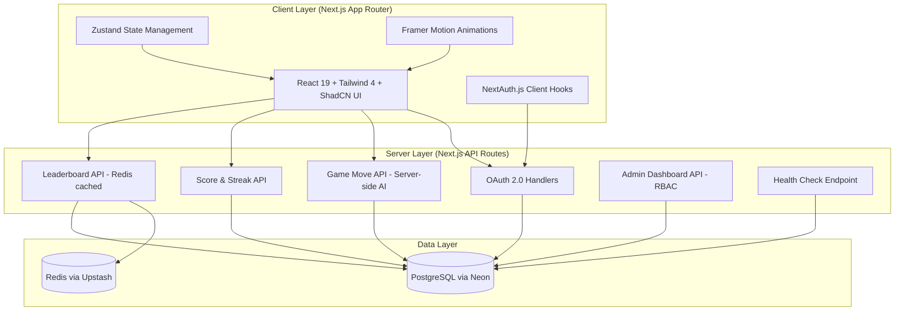
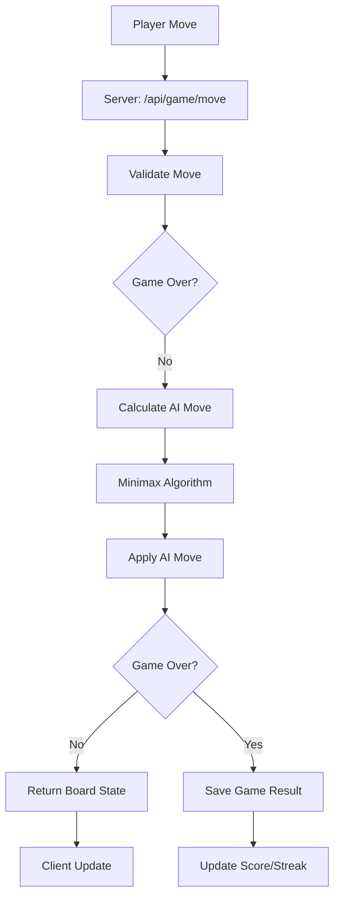
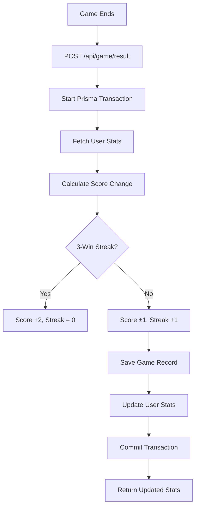
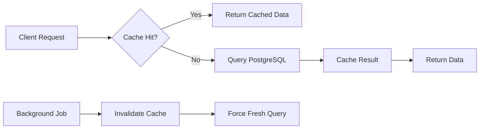
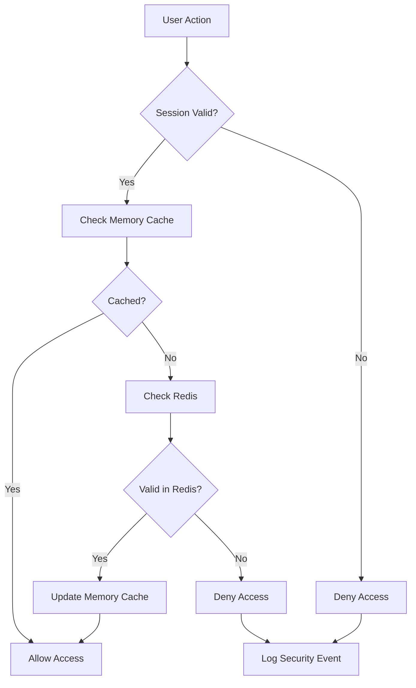
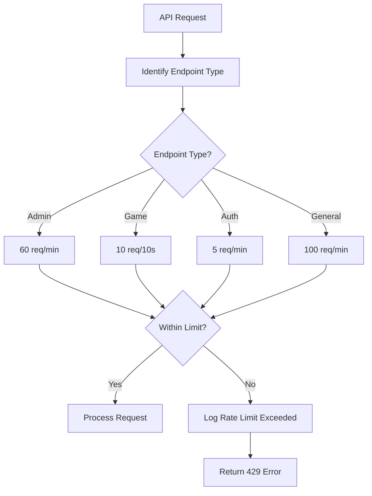
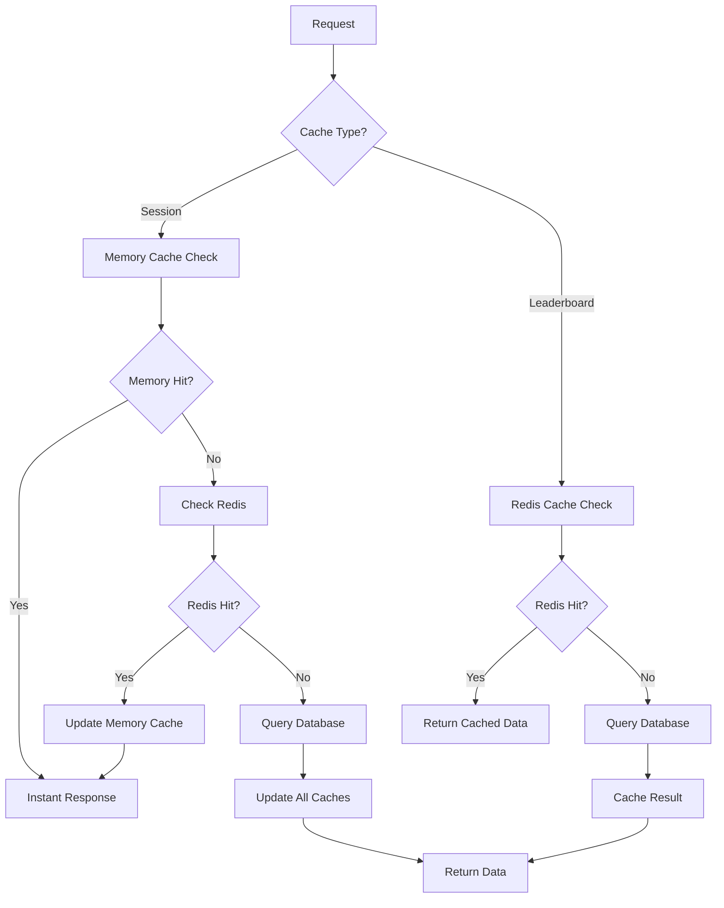

# Architecture Documentation

## Overview

Tic-Tac-Toe Web Application built with **Next.js 16** (App Router), **React 19**, and **Tailwind CSS 4**. Full-stack architecture with server-side AI, PostgreSQL database, and Redis caching.

## High-Level Architecture



## Directory Structure

```
tic-tac-toe-project/
├── src/
│   ├── app/                          # Next.js App Router pages
│   │   ├── (auth)/                   # Route groups (if needed)
│   │   ├── api/                      # API routes
│   │   │   ├── auth/[...nextauth]/  # OAuth handlers
│   │   │   ├── game/                 # Game-related APIs
│   │   │   │   ├── move/             # AI move calculation
│   │   │   │   ├── result/           # Score & streak updates
│   │   │   │   └── history/          # Match history
│   │   │   ├── user/                 # User APIs
│   │   │   │   └── stats/            # User statistics
│   │   │   ├── admin/                # Admin APIs
│   │   │   │   ├── players/          # Player management
│   │   │   │   └── revoke-session/   # Session revocation
│   │   │   ├── leaderboard/          # Leaderboard with caching
│   │   │   └── health/               # Health check
│   │   ├── admin/                    # Admin dashboard page
│   │   ├── game/                     # Main game page
│   │   ├── history/                  # Match history page
│   │   ├── leaderboard/              # Leaderboard page
│   │   ├── login/                    # Login page
│   │   ├── layout.tsx                # Root layout
│   │   ├── page.tsx                  # Home page
│   │   └── globals.css               # Global styles + Tailwind v4 config
│   ├── components/                   # Reusable React components
│   │   ├── game/                     # Game-specific components
│   │   │   ├── game-board.tsx        # Interactive game board
│   │   │   ├── game-info.tsx          # Game status & bot messages
│   │   │   ├── game-controls.tsx     # Difficulty selector & reset
│   │   │   ├── match-replay.tsx       # Game replay component
│   │   │   ├── stats-display.tsx     # Real-time game statistics
│   │   │   └── turn-timer.tsx         # Turn timer with visual indicators
│   │   ├── layout/                   # Layout components
│   │   │   ├── navbar.tsx            # Navigation bar
│   │   │   ├── theme-toggle.tsx      # Dark/light mode toggle
│   │   │   └── navigation-loading.tsx # Loading states for navigation
│   │   ├── providers/                # Context providers
│   │   │   ├── session-provider.tsx # NextAuth session provider
│   │   │   └── query-provider.tsx   # React Query provider
│   │   └── ui/                       # ShadCN UI components
│   │       ├── button.tsx
│   │       ├── card.tsx
│   │       ├── avatar.tsx
│   │       ├── input.tsx
│   │       ├── label.tsx
│   │       ├── tabs.tsx
│   │       ├── loading-spinner.tsx
│   │       ├── page-loading.tsx
│   │       ├── animated-particles.tsx
│   │       └── ...
│   ├── lib/                          # Utility libraries
│   │   ├── api.ts                    # API client with error handling & retries
│   │   ├── game/                     # Game logic and AI
│   │   │   ├── logic.ts              # Core game rules & validation
│   │   │   ├── ai.ts                 # AI algorithms (Easy/Hard)
│   │   │   ├── bot-messages.ts       # Bot personality messages
│   │   │   └── store.ts              # Zustand game state
│   │   ├── auth.ts                   # Auth.js v5 configuration
│   │   ├── prisma.ts                 # Prisma client singleton
│   │   ├── redis.ts                  # Redis client singleton
│   │   ├── memory-cache.ts           # In-memory cache for performance
│   │   ├── session-blacklist.ts      # Session management & blacklist
│   │   ├── security-logger.ts        # Security event logging
│   │   ├── rate-limit.ts             # Advanced rate limiting
│   │   ├── validations.ts            # Zod validation schemas
│   │   ├── config.ts                 # App configuration
│   │   ├── env.ts                    # Environment variable validation
│   │   └── utils.ts                  # Utility functions (cn, etc.)
│   ├── hooks/                        # Custom React hooks
│   │   ├── useAuth.ts                # Authentication state management
│   │   ├── useGame.ts                # Game state & board management
│   │   ├── useGameHistory.ts         # Match history fetching
│   │   ├── useLeaderboard.ts         # Leaderboard data & pagination
│   │   ├── useUserStats.ts           # User statistics & performance
│   │   ├── useTurnTimer.ts           # Turn timer functionality
│   │   └── useSessionValidator.ts    # Session validation
│   ├── constants/                    # Application constants
│   │   └── index.ts                  # API endpoints, game constants
│   ├── types/                        # TypeScript type definitions
│   │   └── next-auth.d.ts           # Auth.js type augmentations
│   ├── __tests__/                     # Unit tests
│   │   └── game/                     # Game logic & AI tests
│   ├── proxy.ts                      # Route protection proxy
│   └── layout.tsx                    # App layout (if separate from app/layout)
├── prisma/                            # Database schema & migrations
│   ├── schema.prisma                  # Prisma schema definition
│   └── prisma.config.ts              # Prisma 7 configuration
├── .github/                           # GitHub Actions CI/CD
│   └── workflows/
│       └── ci.yml                     # CI pipeline
├── public/                            # Static assets
├── .env.example                       # Environment variables template
├── .gitignore                         # Git ignore rules
├── package.json                       # Dependencies & scripts
├── tsconfig.json                      # TypeScript configuration
├── tailwind.config.ts                 # Tailwind CSS configuration (minimal for v4)
├── vitest.config.ts                   # Vitest test configuration
└── README.md                          # Project documentation
```

## Core Components

### 1. Authentication Layer

**File:** `src/lib/auth.ts`
```typescript
export const { auth, handlers, signIn, signOut } = NextAuth({
  adapter: PrismaAdapter(prisma),
  providers: [Google, GitHub],
  callbacks: { session({ session, user }) { ... } }
});
```

**Flow:**
1. OAuth providers (Google/GitHub) → Auth.js v5
2. Database session strategy via Prisma Adapter
3. Session augmentation: `user.id`, `user.role`
4. Middleware protection for protected routes

### 2. Game Logic Layer

**Files:** `src/lib/game/`
- `logic.ts`: Core game rules, win detection, board validation
- `ai.ts`: Minimax algorithm (Hard) + random (Easy)
- `bot-messages.ts`: Dynamic bot personality messages
- `store.ts`: Zustand state management

**AI Architecture:**


### 3. Scoring System

**File:** `src/app/api/game/result/route.ts`

**Transaction Flow:**


### 4. Leaderboard & Caching

**File:** `src/app/api/leaderboard/route.ts`

**Caching Strategy:**


- **Cache Key:** `leaderboard:${page}:${limit}:${search}`
- **TTL:** 60 seconds
- **Client Polling:** 30 seconds
- **Redis Provider:** Upstash (serverless)

### 5. Admin Dashboard

**RBAC Implementation:**
```typescript
// src/proxy.ts
export default auth((req) => {
  if (!req.auth) return NextResponse.redirect("/login");
  return NextResponse.next();
});

// src/app/api/admin/players/route.ts
const user = await prisma.user.findUnique({
  where: { id: session.user.id },
  select: { role: true },
});
if (user?.role !== "admin") {
  return NextResponse.json({ error: "Forbidden" }, { status: 403 });
}
```

## Data Models

### Prisma Schema (`prisma/schema.prisma`)

```prisma
model User {
  id            String    @id @default(cuid())
  email         String    @unique
  name          String?
  image         String?
  role          Role      @default(USER)
  score         Int       @default(0)
  wins          Int       @default(0)
  losses        Int       @default(0)
  draws         Int       @default(0)
  currentStreak Int       @default(0)
  bestStreak    Int       @default(0)
  gamesPlayed   Int       @default(0)
  createdAt     DateTime  @default(now())
  updatedAt     DateTime  @updatedAt
  
  // Relations
  accounts      Account[]
  sessions      Session[]
  games         Game[]
  
  // Indexes
  @@index([email])
  @@index([score(sort: Desc)])
  @@index([role])
}

model Game {
  id            String     @id @default(cuid())
  userId        String
  result        GameResult
  difficulty    Difficulty
  moves         Int[]      // PostgreSQL array type
  duration      Int        // Game duration in seconds
  gridSize      GridSize   @default(THREE_X_THREE)
  finalBoard    String[]   // JSON array of board state
  gameSessionId String     @unique @default(cuid())
  humanPlayer   Player     @default(X)
  createdAt     DateTime   @default(now())
  
  // Relations
  user          User       @relation(fields: [userId], references: [id], onDelete: Cascade)
  
  // Indexes
  @@index([userId, createdAt(sort: Desc)])
  @@index([difficulty, result])
}

// Enums for type safety
enum Role {
  USER
  ADMIN
}

enum GameResult {
  WIN
  LOSS
  DRAW
}

enum Difficulty {
  EASY
  MEDIUM
  HARD
}

enum GridSize {
  THREE_X_THREE
  FOUR_X_FOUR
  FIVE_X_FIVE
}

enum Player {
  X
  O
}

// NextAuth.js models
model Account { ... }
model Session { ... }
model VerificationToken { ... }
```

## API Endpoints

### Authentication
- `GET/POST /api/auth/[...nextauth]` — OAuth handlers (Auth.js v5)

### Game APIs
- `POST /api/game/move` — Server-side AI move calculation
- `POST /api/game/result` — Save game & update score/streak
- `GET /api/game/history` — Paginated match history

### User APIs
- `GET /api/user/stats` — Current user statistics

### Leaderboard
- `GET /api/leaderboard` — Paginated, searchable, Redis-cached

### Admin APIs
- `GET /api/admin/players` — All player data (RBAC protected)
- `POST /api/admin/revoke-session` — Revoke user session (blacklist)

### Health
- `GET /api/health` — Service health check with DB latency

## State Management

### Zustand Store (`src/lib/game/store.ts`)

```typescript
interface GameState {
  board: Board;
  humanPlayer: Player;
  aiPlayer: Player;
  currentTurn: Player;
  difficulty: Difficulty;
  gameResult: GameResult;
  winningLine: number[] | null;
  isAiThinking: boolean;
  botMessage: string;
  moves: number[];
  gameStartTime: number | null;
  gameDuration: number;
}
```

**State Flow:**
1. **Client Actions:** Click cell → Dispatch to store
2. **API Call:** POST `/api/game/move` with current state
3. **Server Response:** New board state + bot message
4. **Store Update:** Update all relevant state slices
5. **UI Re-render:** Reactive updates via Zustand

## Security Architecture

### 1. Authentication
- **OAuth 2.0** via Auth.js v5 (Google/GitHub)
- **Database Sessions** (not JWT)
- **Middleware Protection** for all protected routes
- **Session Blacklist** with instant revocation capability

### 2. Authorization
- **Role-Based Access Control (RBAC)**
- **Admin-only endpoints** with role validation
- **Session augmentation** for user.id and user.role

### 3. Session Management


### 4. Data Integrity
- **Prisma Transactions** for atomic score updates
- **Server-side AI** prevents client-side cheating
- **Input validation** on all API endpoints (Zod schemas)
- **Type safety** throughout the application

### 5. Advanced Rate Limiting


### 6. Security Logging
- **Event Types**: Rate limiting, unauthorized access, suspicious activity, admin access
- **Structured Logging**: IP, user agent, endpoint, timestamp, details
- **Memory Storage**: Last 1000 events for monitoring
- **Development Visibility**: Console warnings in development mode

## Performance Optimizations

### 1. Database
- **Connection Pooling** via Prisma
- **Atomic Transactions** minimize round trips
- **Selective Queries** with specific field selection
- **Compound Indexes** for leaderboard queries

### 2. Caching Strategy


- **Memory Cache**: Sub-millisecond response for critical operations
- **Redis Cache**: Distributed caching for production scalability
- **Leaderboard Cache**: 60s TTL with 30s client polling
- **Session Cache**: 5min TTL with instant blacklist capability

### 3. Client Performance
- **Zustand** for efficient state updates with selectors
- **Framer Motion** for smooth animations
- **Tailwind CSS 4** for optimized styles
- **React Query** for server state management
- **Debounced Search** to prevent excessive API calls

## Deployment Architecture

### Production Stack
- **Frontend:** Vercel (Next.js 16 with Turbopack)
- **Database:** Neon PostgreSQL (serverless)
- **Cache:** Upstash Redis (serverless)
- **CI/CD:** GitHub Actions

### Environment Variables
```bash
# Core
DATABASE_URL="postgresql://..."
AUTH_URL="https://your-app.vercel.app"
AUTH_SECRET="..."

# OAuth
AUTH_GOOGLE_ID="..."
AUTH_GOOGLE_SECRET="..."
AUTH_GITHUB_ID="..."
AUTH_GITHUB_SECRET="..."

# Services
UPSTASH_REDIS_REST_URL="..."
UPSTASH_REDIS_REST_TOKEN="..."
```

## Development Workflow

### 1. Local Development
```bash
npm run dev          # Next.js dev server with Turbopack
npm run test         # Run unit tests
npm run test:watch   # Watch mode tests
npx prisma studio    # Database browser
```

### 2. Testing Strategy
- **Unit Tests**: Vitest for game logic & AI algorithms (23 tests passing)
- **Integration Tests**: API endpoint testing with authentication
- **Security Tests**: Rate limiting, input validation, RBAC testing
- **Performance Tests**: Cache performance, database query optimization
- **E2E Tests**: Playwright for full user flows (planned)

### Test Coverage
```bash
# Game Logic Tests (17 tests)
- Win detection for all combinations
- Draw detection
- Board validation
- Move validation

# AI Tests (6 tests)
- Minimax algorithm correctness
- Easy mode randomness
- Unbeatable hard mode
- Performance benchmarks
```

### 3. Code Quality
- **TypeScript** for type safety
- **ESLint** for code standards
- **GitHub Actions CI** for automated checks

## Future Enhancements

### Planned Features
1. **E2E Testing Suite** with Playwright
2. **Real-time Multiplayer** via WebSockets
3. **Tournament Mode** with bracket system
4. **Advanced Analytics** dashboard with heatmaps
5. **Mobile App** via React Native
6. **AI Difficulty Adaptation** based on player performance
7. **Game Recording** with shareable replays
8. **Achievement System** with badges and rewards

### Scalability Considerations
1. **Database Sharding** for high user volume
2. **CDN Integration** for global performance
3. **Microservices** for specific game features
4. **WebSocket Scaling** for real-time features
5. **Redis Cluster** for distributed caching
6. **Load Balancing** for API endpoints
7. **Monitoring & Alerting** for production health

---

This architecture ensures a maintainable, scalable, and secure Tic-Tac-Toe application with modern web development best practices.
