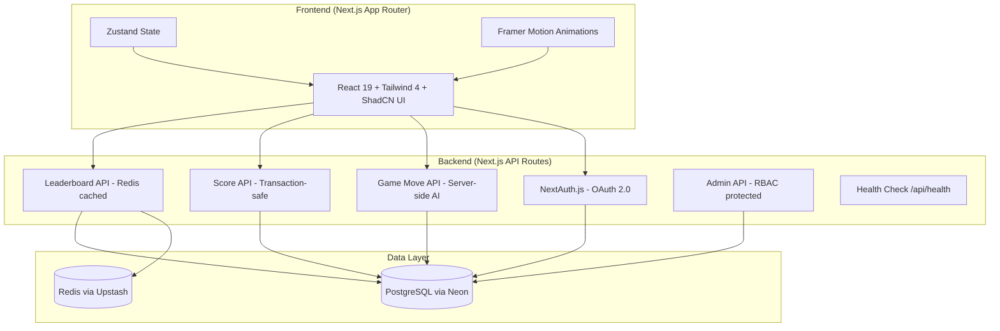
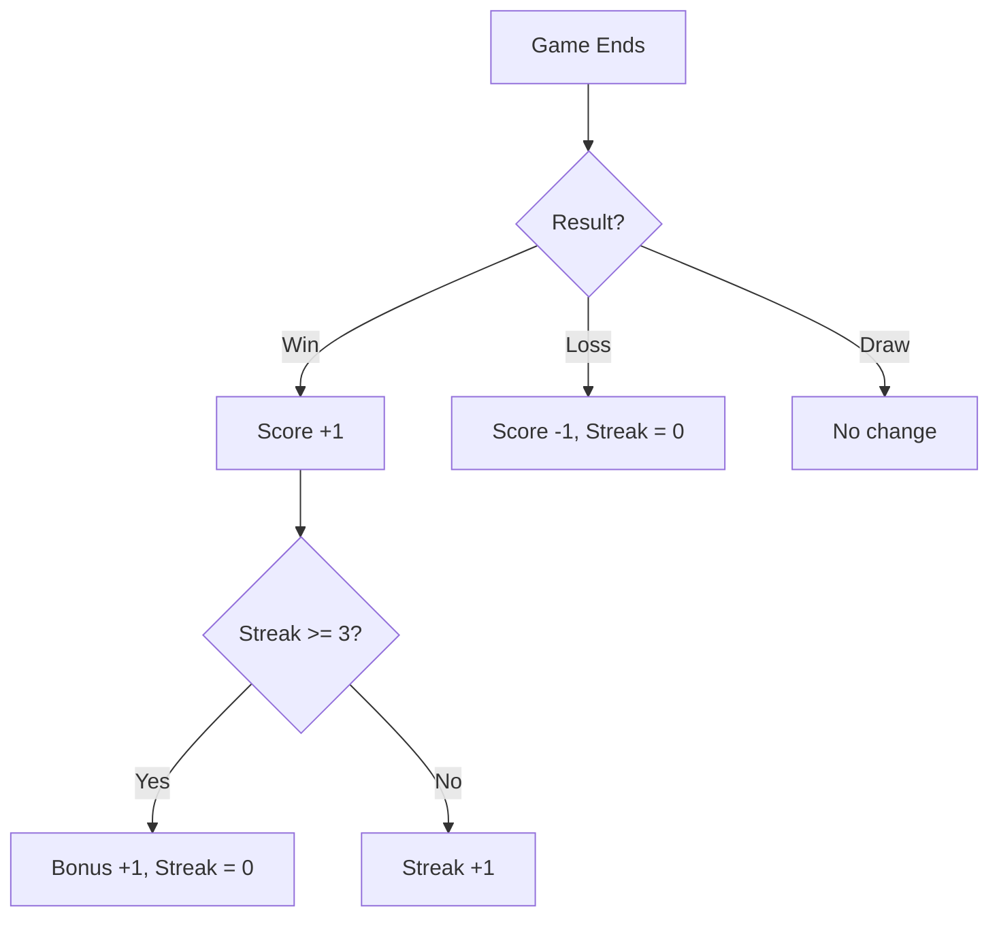

# Tic-Tac-Toe | Player vs AI Bot

A full-stack web application built with **Next.js 16**, **React 19**, and **Tailwind CSS 4**. Players sign in via OAuth 2.0, challenge an AI bot at two difficulty levels, and compete on a global leaderboard.

## Architecture



## Tech Stack

| Layer | Technology | Version |
|-------|-----------|---------|
| Framework | Next.js (App Router) | 16.x |
| UI | React + Tailwind CSS + ShadCN UI | 19.x / 4.x |
| Animation | Framer Motion | 12.x |
| State | Zustand | 5.x |
| Auth | Auth.js v5 (OAuth 2.0) | 5.x |
| Database | PostgreSQL (Neon) + Prisma ORM | 7.x |
| Cache | Redis (Upstash) | - |
| Testing | Vitest | 4.x |
| CI/CD | GitHub Actions | - |
| Hosting | Vercel (Free Tier) | - |

## Features

### Core (Required)
- **OAuth 2.0 Login** — Google & GitHub sign-in via NextAuth.js
- **Player vs Bot** — Standard 3×3 Tic-Tac-Toe
- **Scoring** — Win +1, Loss −1, 3-win streak bonus +1 (streak resets)
- **Admin Dashboard** — View all player scores (RBAC protected)

### Extra
- **AI Difficulty** — Easy (random) & Hard (Minimax, unbeatable)
- **Bot Personality** — Taunting messages based on board state
- **Match History** — View past games with replay functionality
- **Leaderboard** — Paginated, searchable, Redis-cached (30s polling)
- **Dark/Light Mode** — System-aware theme toggle
- **Responsive UI** — Mobile-first design, works on all devices
- **Health Endpoint** — `/api/health` for monitoring

### Engineering Quality
- **23 Unit Tests** — Game logic & AI correctness (Vitest)
- **CI/CD Pipeline** — Lint → Type Check → Test on every PR
- **Server-side AI** — All game logic runs on server to prevent cheating
- **Atomic Transactions** — Score + streak updates in single DB transaction
- **Rate Limiting** — Upstash Redis (100 req/min per user)

## Getting Started

### Prerequisites
- Node.js 20+
- PostgreSQL database (free via [Neon](https://neon.tech))
- Redis instance (free via [Upstash](https://upstash.com))
- OAuth credentials (Google and/or GitHub)

### Setup

```bash
# 1. Clone the repository
git clone https://github.com/your-username/tic-tac-toe-app.git
cd tic-tac-toe-app

# 2. Install dependencies
npm install

# 3. Configure environment variables
cp .env.example .env
# Edit .env with your database URL, OAuth keys, and Redis credentials

# 4. Generate Prisma client & push schema
npx prisma generate
npx prisma db push

# 5. Start development server
npm run dev
```

### Environment Variables

| Variable | Description |
|----------|-------------|
| `DATABASE_URL` | PostgreSQL connection string |
| `AUTH_URL` | App URL (e.g., `http://localhost:3000`) |
| `AUTH_SECRET` | Random secret (`openssl rand -base64 32`) |
| `AUTH_GOOGLE_ID` | Google OAuth client ID |
| `AUTH_GOOGLE_SECRET` | Google OAuth client secret |
| `AUTH_GITHUB_ID` | GitHub OAuth client ID |
| `AUTH_GITHUB_SECRET` | GitHub OAuth client secret |
| `UPSTASH_REDIS_REST_URL` | Upstash Redis REST URL |
| `UPSTASH_REDIS_REST_TOKEN` | Upstash Redis REST token |
| `ADMIN_EMAILS` | Comma-separated admin emails |

### Scripts

```bash
npm run dev          # Start dev server (Turbopack)
npm run build        # Production build
npm run lint         # ESLint
npm run type-check   # TypeScript check
npm test             # Run unit tests
npm run test:watch   # Watch mode tests
npm run db:generate  # Generate Prisma client
npm run db:push      # Push schema to database
npm run db:studio    # Open Prisma Studio
```

## Scoring Logic



## Project Structure

```
src/
├── app/
│   ├── api/
│   │   ├── auth/[...nextauth]/  # OAuth routes
│   │   ├── game/move/           # Server-side AI move
│   │   ├── game/result/         # Save game & update score
│   │   ├── game/history/        # Match history
│   │   ├── leaderboard/         # Leaderboard (Redis cached)
│   │   ├── admin/players/       # Admin player list (RBAC)
│   │   ├── user/stats/          # User statistics
│   │   └── health/              # Health check
│   ├── admin/                   # Admin dashboard page
│   ├── game/                    # Game page
│   ├── history/                 # Match history page
│   ├── leaderboard/             # Leaderboard page
│   ├── login/                   # Login page
│   └── layout.tsx               # Root layout
├── components/
│   ├── game/                    # GameBoard, GameInfo, GameControls, MatchReplay
│   ├── layout/                  # Navbar, ThemeToggle
│   ├── providers/               # SessionProvider
│   └── ui/                      # ShadCN components (Button, Card, Avatar)
├── lib/
│   ├── game/                    # logic.ts, ai.ts, bot-messages.ts, store.ts
│   ├── auth.ts                  # NextAuth config
│   ├── prisma.ts                # Prisma client singleton
│   ├── redis.ts                 # Redis client singleton
│   └── utils.ts                 # cn() utility
├── __tests__/
│   └── game/                    # Unit tests for logic & AI
└── middleware.ts                 # Route protection
```

## Design Decisions

1. **Next.js Fullstack** — Single deployment, no CORS issues, server-side AI prevents cheating
2. **Prisma Transactions** — Score + streak atomicity guarantees data integrity
3. **Redis Leaderboard Cache** — 60s TTL reduces DB load; client polls every 30s
4. **Minimax AI** — Provably optimal for 3×3 board; Easy mode uses controlled randomness
5. **Auth.js v5** — Industry-standard OAuth 2.0, `auth()` server helper, middleware-native

## License

MIT
