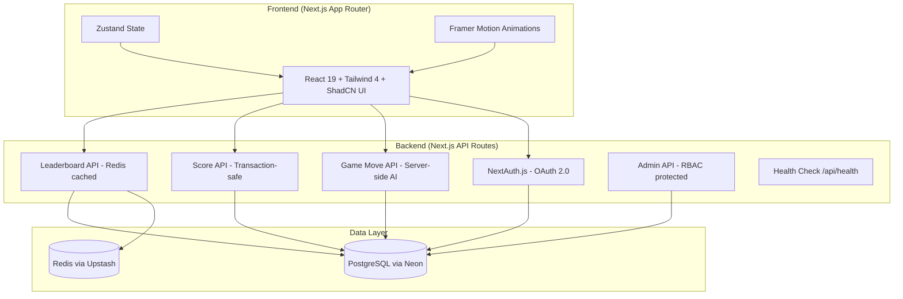
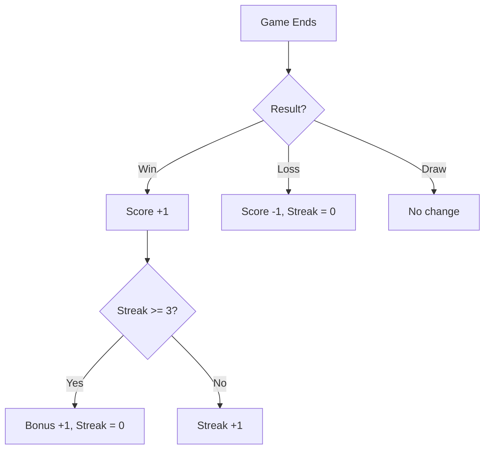

# Tic-Tac-Toe | Player vs AI Bot

A full-stack web application built with **Next.js 16**, **React 19**, and **Tailwind CSS 4**. Players sign in via OAuth 2.0, challenge an AI bot at two difficulty levels, and compete on a global leaderboard.

## Architecture



## Tech Stack

| Layer | Technology | Version |
|-------|-----------|---------|
| Framework | Next.js (App Router) | 16.1.x |
| UI | React + Tailwind CSS + ShadCN UI | 19.2.x / 4.2.x |
| Animation | Framer Motion | 12.34.x |
| State | Zustand | 5.0.x |
| Auth | Auth.js v5 (OAuth 2.0) | 5.0.x-beta |
| Database | PostgreSQL (Neon) + Prisma ORM | 6.19.x |
| Cache | Redis (Upstash) | 1.36.x |
| Testing | Vitest | 4.0.x |
| Validation | Zod | 4.3.x |
| Rate Limiting | Upstash Ratelimit | 2.0.x |
| CI/CD | GitHub Actions | - |
| Hosting | Vercel (Free Tier) | - |

## Features

### Core (Required)
- **OAuth 2.0 Login** — Google & GitHub sign-in via NextAuth.js
- **Player vs Bot** — Standard 3×3 Tic-Tac-Toe (expandable to 4×4, 5×5)
- **Scoring** — Win +1, Loss −1, 3-win streak bonus +1 (streak resets)
- **Admin Dashboard** — View all player scores, session management (RBAC protected)

### Extra
- **AI Difficulty** — Easy (random), Medium, Hard (Minimax, unbeatable)
- **Bot Personality** — Taunting messages based on board state
- **Match History** — View past games with full replay functionality
- **Leaderboard** — Paginated, searchable, Redis-cached (30s polling)
- **Turn Timer** — Configurable timer per turn with visual indicators
- **Game Stats** — Real-time statistics display and performance tracking
- **Dark/Light Mode** — System-aware theme toggle with smooth transitions
- **Responsive UI** — Mobile-first design, works on all devices
- **Health Endpoint** — `/api/health` for monitoring
- **Animated Particles** — Dynamic background effects for enhanced UX

### Engineering Quality
- **23 Unit Tests** — Game logic & AI correctness (Vitest)
- **CI/CD Pipeline** — Lint → Type Check → Test on every PR
- **Server-side AI** — All game logic runs on server to prevent cheating
- **Atomic Transactions** — Score + streak updates in single DB transaction
- **Advanced Rate Limiting** — Tiered limits per endpoint (Upstash Redis)
- **Session Management** — Blacklist functionality with memory + Redis caching
- **Security Logging** — Comprehensive security event tracking and monitoring
- **Input Validation** — Zod schemas for all API endpoints with type safety
- **Memory Cache** — In-memory caching layer for performance optimization
- **Error Handling** — Structured error responses with proper HTTP status codes

## Getting Started

### Prerequisites
- Node.js 20+
- PostgreSQL database (free via [Neon](https://neon.tech))
- Redis instance (free via [Upstash](https://upstash.com))
- OAuth credentials (Google and/or GitHub)

### Setup

```bash
# 1. Clone the repository
git clone https://github.com/your-username/tic-tac-toe-app.git
cd tic-tac-toe-app

# 2. Install dependencies
npm install

# 3. Configure environment variables
cp .env.example .env
# Edit .env with your database URL, OAuth keys, and Redis credentials

# 4. Generate Prisma client & push schema
npx prisma generate
npx prisma db push

# 5. Start development server
npm run dev
```

### Environment Variables

| Variable | Description |
|----------|-------------|
| `DATABASE_URL` | PostgreSQL connection string |
| `AUTH_URL` | App URL (e.g., `http://localhost:3000`) |
| `AUTH_SECRET` | Random secret (`openssl rand -base64 32`) |
| `AUTH_GOOGLE_ID` | Google OAuth client ID |
| `AUTH_GOOGLE_SECRET` | Google OAuth client secret |
| `AUTH_GITHUB_ID` | GitHub OAuth client ID |
| `AUTH_GITHUB_SECRET` | GitHub OAuth client secret |
| `UPSTASH_REDIS_REST_URL` | Upstash Redis REST URL |
| `UPSTASH_REDIS_REST_TOKEN` | Upstash Redis REST token |
| `ADMIN_EMAILS` | Comma-separated admin emails |

### Scripts

```bash
npm run dev              # Start dev server (Turbopack)
npm run build            # Production build
npm run start            # Start production server
npm run lint             # ESLint (.js, .jsx, .ts, .tsx)
npm run type-check       # TypeScript type checking (tsc --noEmit)
npm test                 # Run all tests (vitest run)
npm run test:watch       # Run tests in watch mode (vitest)
npm run db:generate      # Generate Prisma client
npm run db:push          # Push schema to database
npm run db:studio        # Open Prisma Studio
```

### Running a Single Test

```bash
# Run a specific test file
npx vitest run src/__tests__/game/logic.test.ts

# Run tests matching a pattern
npx vitest run --grep "checkWinner"

# Run a specific test by name
npx vitest run --testNamePattern "should detect X winning"
```

## API Endpoints

### Authentication
- `GET/POST /api/auth/signin` — OAuth sign-in endpoints
- `GET/POST /api/auth/signout` — Sign out endpoint
- `GET /api/auth/session` — Get current session
- `GET /api/auth/providers` — List OAuth providers

### Game
- `POST /api/game/move` — Get AI move for current board state
- `POST /api/game/result` — Submit game result and update score
- `GET /api/game/history` — Get user's match history

### Leaderboard & Stats
- `GET /api/leaderboard` — Get global leaderboard (paginated, searchable)
- `GET /api/user/stats` — Get current user statistics

### Admin (RBAC Protected)
- `GET /api/admin/players` — List all players with advanced filtering
- `POST /api/admin/revoke-session` — Revoke user session (blacklist)

### System
- `GET /api/health` — Health check endpoint for monitoring

## Scoring Logic



## Project Structure

```
src/
├── app/
│   ├── api/
│   │   ├── auth/[...nextauth]/  # OAuth routes
│   │   ├── game/move/           # Server-side AI move
│   │   ├── game/result/         # Save game & update score
│   │   ├── game/history/        # Match history
│   │   ├── leaderboard/         # Leaderboard (Redis cached)
│   │   ├── admin/players/       # Admin player list (RBAC)
│   │   ├── admin/revoke-session/# Admin session revocation
│   │   ├── user/stats/          # User statistics
│   │   └── health/              # Health check
│   ├── admin/                   # Admin dashboard page
│   ├── game/                    # Game page
│   ├── history/                 # Match history page
│   ├── leaderboard/             # Leaderboard page
│   ├── login/                   # Login page
│   └── layout.tsx               # Root layout
├── components/
│   ├── game/                    # GameBoard, GameInfo, GameControls, MatchReplay, StatsDisplay, TurnTimer
│   ├── layout/                  # Navbar, ThemeToggle, NavigationLoading
│   ├── providers/               # SessionProvider, QueryProvider
│   └── ui/                      # ShadCN components (Button, Card, Avatar, Input, Label, Tabs, LoadingSpinner, AnimatedParticles)
├── lib/
│   ├── api.ts                   # API client with error handling
│   ├── game/                    # logic.ts, ai.ts, bot-messages.ts, store.ts
│   ├── auth.ts                  # NextAuth config
│   ├── prisma.ts                # Prisma client singleton
│   ├── redis.ts                 # Redis client singleton
│   ├── memory-cache.ts          # In-memory cache for performance
│   ├── session-blacklist.ts     # Session management & blacklist
│   ├── security-logger.ts       # Security event logging
│   ├── rate-limit.ts            # Advanced rate limiting
│   ├── validations.ts           # Zod validation schemas
│   ├── config.ts                # App configuration
│   ├── env.ts                    # Environment variable validation
│   └── utils.ts                 # cn() utility
├── hooks/                       # Custom React hooks
│   ├── useAuth.ts               # Authentication state
│   ├── useGame.ts              # Game state management
│   ├── useGameHistory.ts       # Match history
│   ├── useLeaderboard.ts       # Leaderboard data
│   ├── useUserStats.ts         # User statistics
│   ├── useTurnTimer.ts         # Turn timer functionality
│   └── useSessionValidator.ts  # Session validation
├── constants/                   # Application constants
│   └── index.ts                # API endpoints, game constants
├── types/                       # TypeScript type definitions
│   └── next-auth.d.ts          # Auth.js type augmentations
├── __tests__/                   # Unit tests
│   └── game/                   # Game logic & AI tests
└── proxy.ts                     # Route protection
```

## Security Features

### Authentication & Authorization
- **OAuth 2.0** — Secure Google & GitHub authentication via Auth.js v5
- **Role-Based Access Control (RBAC)** — Admin-only endpoints protected
- **Session Management** — Blacklist functionality with instant revocation
- **Memory + Redis Caching** — Dual-layer session caching for performance

### API Security
- **Advanced Rate Limiting** — Tiered limits per endpoint type:
  - Admin: 60 req/min (UI operations need flexibility)
  - Game: 10 req/10s (prevent abuse)
  - Auth: 5 req/min (sensitive operations)
  - General: 100 req/min (normal usage)
- **Input Validation** — Zod schemas for all API endpoints with type safety
- **Security Logging** — Comprehensive event tracking (rate limits, unauthorized access, suspicious activity)
- **Error Handling** — Structured error responses without sensitive data exposure

### Performance & Reliability
- **Memory Cache** — In-memory caching for instant response times
- **Redis Fallback** — Distributed cache for production scalability
- **Atomic Transactions** — Database consistency guaranteed
- **Health Monitoring** — `/api/health` endpoint for uptime checks

## Design Decisions

1. **Next.js Fullstack** — Single deployment, no CORS issues, server-side AI prevents cheating
2. **Prisma Transactions** — Score + streak atomicity guarantees data integrity
3. **Redis Leaderboard Cache** — 60s TTL reduces DB load; client polls every 30s
4. **Minimax AI** — Provably optimal for 3×3 board; Easy mode uses controlled randomness
5. **Auth.js v5** — Industry-standard OAuth 2.0, `auth()` server helper, middleware-native
6. **Session Blacklist** — Memory-first caching with Redis fallback for instant session revocation
7. **Tiered Rate Limiting** — Different limits per endpoint type balances security with UX
8. **Zod Validation** — Runtime type safety eliminates `any` types and ensures data integrity
9. **Security Logging** — Comprehensive monitoring for security events and suspicious activity
10. **Memory Cache Layer** — In-memory caching provides sub-millisecond response for critical operations

